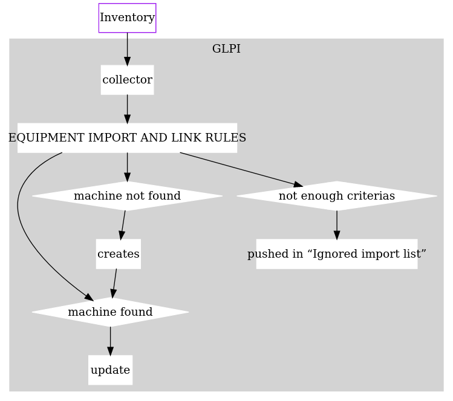

# How works 'Equipment import and link rules'

!!! warning
    Equipment import and link rules are complex and misconfiguration can seriously hurt your GLPI.

## First thing to know

The rules engine goal is to detect if a device exists
or if it has to be created.

The rule engine is used for:

* computers
* network devices
* network printers

Common problems related to the rule engine are:

* duplicated device.
* device pushed in the “Ignored import devices”

The engine stops on the first checked rule.

## When these rules are played?

It's played in these cases:

* Computer inventory, including  ESX servers
* Network discovery 
* Network Inventory (switches, printers...)

!!! info
    Port MAC addresses from network switch are not used as criterias

## Criteria of a rule

The criteria can be either normal or global.

### Normal criteria

The normal criteria are defined by an information (IP, MAC, etc) and a filter:

* _is_
* _is not_
* _contains_
* _does not contains_
* _starting with_
* _finished by_
* _regular expression checks_
* _regular expression does not match_
* _exists_: mean the value exist and not be empty in the inventory come from the agent
* _does not exist_: mean the value doesn't exist in the inventory come from the agent

### Global criteria

* _Search GLPI equipement with this status_: search in GLPI database if the device exist with value defined

If the device is found, all criteria are checked, this rule is checked and now run the actions

## Actions of a rule

The actions are defined by:

* _FusionInventory link_ > _Link if possible, else create device_: if device is found (in case use a global criteria), update this device, else create a new device with itemtype defined in inventory (computer, switches...)
* _FusionInventory link_ > _Link if possible, else import denied_: if device is found (in case use a global criteria), update this device, else deny creation of device and so is not be imported in GLPI inventory
* _FusionInventory link_ > _Import denied_

