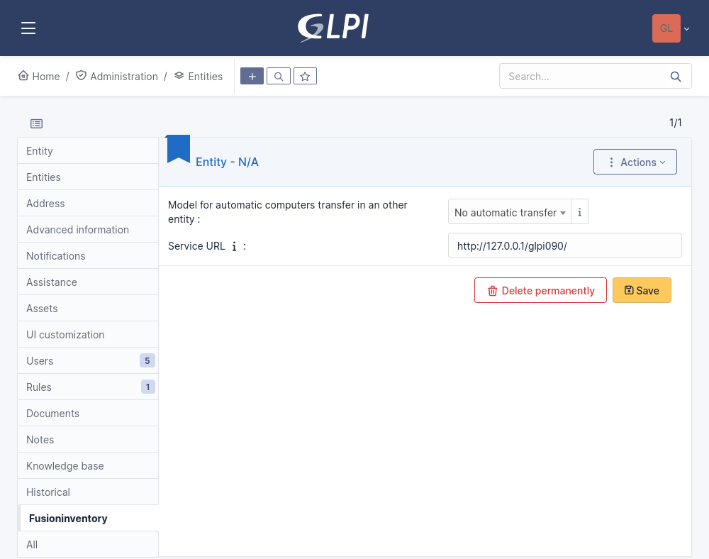

# Installation

## Get the archive for your GLPI

First, download archive: 

* Recent versions (>= 0.90) : <https://github.com/fusioninventory/fusioninventory-for-glpi/releases>

FusionInventory for GLPI tarball name follow this convention:

* fusioninventory-for-glpi_
* GLPI major release (0.80, 0.83, 0.84, 0.85, etc)
* a '+' symbol
* FusionInventory release

!!! example "Examples"
    * 9.5+4.0

    * 10.0.0+1.0

## Installation

!!! warning
    If a previous FusionInventory version is already installed, you must read the [Update page](./update.md).

!!! important
    Please, do a backup of your database before install :sweat_smile:

* Uncompress the archive into the plugin folder of GLPI. File list looks like:

```
|- glpi
   |- plugins
      |- fusioninventory
         |- index.php
         |- hook.php
         |- inc
         |- ...
```

!!! note "Installation procedure"

    === "CLI installation (recommanded)"
        Run these commands from console / terminal:
        ``` shell
        php bin/console glpi:plugin:install --username=glpi fusioninventory
        php bin/console glpi:plugin:activate --username=glpi fusioninventory
        ```


    === "Web interface installation"

        * Connect to _GLPI_
        * Go in the menu _Setup_ > _Plugins_
        * Install the plugin FusionInventory
        * Activate FusionInventory 


## Initial configuration

Once the plugin is activated, you will have to go on the _Administration > Entities > Root entity > tab FusionInventory_
page to set the *Service URL*. You need to enter the location of your GLPI server, for example `http://glpi.mydomain/`, **do not add plugins/fusioninventory** in the URL.




## Options detail in general configuration

In general configuration of the plugin FusionInventory for GLPI, there are the options:

SSL-only for agent: send an error response to an agent when this agent communicates to the server without SSL.

## Security

!!! important
    We strongly recommend to activate SSL on the server side to protect human user communications, and eventually agent communications too.

See [security page](../security.md) for details.

## GLPI cron

It's very important for tasks management, see [cron in GLPI](./cron.md) for details.

## Agent configuration

Once this is done, you can [install](../FusionInventory_agent/installation/) and [configure](../FusionInventory_agent/configuration/configuration.md) your agents.

